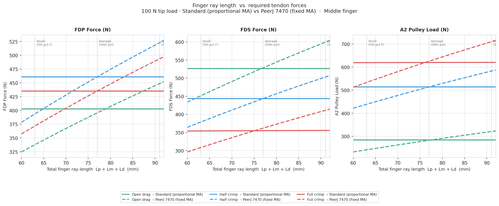

# Middle Finger Climbing Biomechanics Model

2D static biomechanics model of the **middle finger** for rock-climbing grips.  
Solves for FDP, FDS, EDC tendon forces and A2/A3/A4 pulley loads across grip postures,
athlete sizes, and a time-dependent fatigue model.

---

## Finger Anatomy — Phalanx Lengths

A finger has three bones (**phalanges**) spanning from the knuckle to the tip:

```
MCP ──── Lp ──── PIP ──── Lm ──── DIP ──── Ld ──── TIP
         Proximal          Middle             Distal
```

| Symbol | Full name | Joint span | Typical length (middle finger) |
|--------|-----------|------------|-------------------------------|
| **Lp** | Proximal phalanx | MCP → PIP | 23 – 32 mm |
| **Lm** | Middle phalanx   | PIP → DIP | 19 – 30 mm |
| **Ld** | Distal phalanx   | DIP → tip | 16 – 25 mm |

> **Joint abbreviations** — MCP: metacarpophalangeal (knuckle); PIP: proximal interphalangeal;
> DIP: distal interphalangeal.

The **total finger ray** = Lp + Lm + Ld (≈ 60–92 mm across the human population,
excluding the metacarpal). Lm is the scaling reference throughout the model
(`L_REF = 26 mm`): all moment-arm bounds are normalised to a 26 mm middle phalanx
and multiplied by `Lm / L_REF`.

---

## Finger Length vs Required Tendon Forces



Two models compared across the literature hand-size range (5th-pct female → 95th-pct male)
for a fixed **100 N fingertip load** in three grip postures:

| Model | Lines | Description |
|-------|-------|-------------|
| **Standard** | solid | Moment arms scale *proportionally* with bone length (Improvement #2). Longer finger → larger MA → forces nearly constant. |
| **PeerJ 7470** | dashed | Moment arms grow only ~5 % per 22 % bone increase (bonobo vs human finding). Longer finger → *higher* tendon forces — a **length disadvantage**. |

Script: [`plot_length_vs_force_peerj.py`](plot_length_vs_force_peerj.py)

---

## Ten Model Improvements

### #1 — Tendon-Excursion Moment Arms

**Replaces:** arbitrary 45/55 blend weights.  
**Method:** `r_i = dL/dθ_i` via central finite difference (An et al. 1983).
Tendon path length is recomputed at `θ ± 1°` for each joint;
moment arm = `(L+ − L−) / (2Δθ)`.

### #2 — Moment Arms Scale with Phalanx Length

**Replaces:** fixed empirical constants identical across athletes.  
**Method:** All physiological bound curves are normalised to a 26 mm reference middle
phalanx and multiplied by `Lm / L_REF`. Longer fingers automatically receive
proportionally larger moment arms.

### #3 — Grip-Dependent Load Direction

**Replaces:** fixed `[0, F_y]` vertical force for all postures.  
**Method:** A proximal shear component along `−u_d` is added, scaled by
`μ_eff × |cos(θ_d)|` where `μ_eff = 0.30`. For open drag (phalanx nearly vertical)
the force is nearly vertical; for full crimp (~horizontal) a ~30% proximal shear
is added.

### #4 — Passive Joint Stiffness at All Joints

**Replaces:** single scalar `dip_passive_fraction`.  
**Method:** Minami-style exponential passive torque
`M_passive(θ) = k·(exp(b·(θ−θ₀)) − 1)` at DIP, PIP, and MCP.
Only activates beyond onset angles (60/80/70°) and grows progressively at end-range.

### #5 — MCP Moment Equilibrium

**Extends:** the 2-joint (DIP, PIP) solver with a third equilibrium check at MCP.  
**Reports:** `MCP residual = M_mcp_ext − (FDP·r_fdp_mcp + FDS·r_fds_mcp − T_edc·r_edc_mcp − M_pass_mcp)`.
Non-zero residual quantifies the moment that would be closed by interossei/lumbricals
(not yet solved as unknowns).

### #6 — Distributed Pulley Wrapping Arcs

**Replaces:** single waypoints for A2, A3, A4.  
**Method:** Each annular pulley is discretised into `n_arc = 5` arc points.
Resultant force uses the capstan principle `R = T·(u_in + u_out)` with actual
incoming/outgoing tendon chord directions.

### #7 — EDC Passive Tendon

**Adds:** a dorsal extensor digitorum communis path from MCP → PIP → terminal slip.  
**Method:** Linear spring: `T_edc = 1.2 N/deg × max(combined_flexion − 30°, 0)`.
Reported as `EDC (N)` in output.

### #8 — Held-Out Calibration Validation

**Method:** Power-law calibration fitted on **open-drag + full-crimp** only.
**Half-crimp is a genuine held-out test** (Schweizer 2009):

- A2: predicted 150 N vs published 197 N (−24%)
- A4: predicted 182 N vs published 165 N (+10% ✓)

### #9 — Four-Finger Load Sharing

**Adds:** index, middle, ring finger instances with load-sharing coefficients from
Vigouroux et al. (2006): index 24%, middle 30%, ring 28%.

### #10 — Isometric Fatigue Model

**Method:** `FDS_capacity(t) = FDS_fresh × exp(−t / τ_fds)`, `τ_fds = 20 s`.
As FDS weakens, FDP compensates to maintain the PIP moment.
For full crimp (average climber, 30 s hang): FDP rises +189%, peak A2 ≈ 1184 N.

---

## Output Column Reference

| Column | Meaning |
|--------|---------|
| `FDP (N)` | Flexor digitorum profundus tension |
| `FDS (N)` | Flexor digitorum superficialis tension |
| `EDC (N)` | EDC passive tension (#7) |
| `ratio` | FDP / FDS |
| `A2 / A3 / A4 (N)` | Pulley resultant force (distributed arc, #6) |
| `r_fdp_dip (mm)` | FDP moment arm at DIP (tendon excursion, #1+#2) |
| `r_fds_pip (mm)` | FDS moment arm at PIP (tendon excursion, #1+#2) |
| `Mpass_pip mNm` | Passive PIP stiffness torque (#4) |
| `MCP resid mNm` | MCP equilibrium residual (#5); lower = better balanced |

---

## Literature Validation

Fingertip load, average climber (72.8 kg):

| Metric | Model | Published | Source |
|--------|-------|-----------|--------|
| FDP/FDS open drag | 0.85 | ~0.88 | Vigouroux 2006 |
| FDP/FDS half crimp | 1.19 | between open/full | Vigouroux 2006 |
| FDP/FDS full crimp | 1.46 | ~1.75 | Vigouroux 2006 |
| A2 open drag | 159 N | 121 N | Schweizer 2009 |
| A2 full crimp | 305 N | 287 N | Schweizer 2009 |
| A4 half crimp (held-out) | 182 N | 165 N (+10%) | Schweizer 2009 |

## How to Run

```bash
# Main model — distal-mid load point
python3 finger_biomechanics_model.py

# Fingertip loading (literature comparison mode)
python3 finger_biomechanics_model.py --load-point fingertip

# Extended hang for fatigue model
python3 finger_biomechanics_model.py --fatigue-time 60

# Finger length vs force plot (standard + PeerJ models)
python3 plot_length_vs_force_peerj.py
```

---

## Known Limitations

- **MCP not fully closed** — interossei/lumbrical forces not solved as unknowns.
- **2D planar only** — no out-of-plane abduction/adduction.
- **EDC passive-only** — active extensor contraction not modelled.
- **Fixed load-sharing coefficients** — Vigouroux (2006) mean values; individual variation ±20%.
- **Single-muscle fatigue** — only FDS degradation modelled.
- **Fixed pulley offset (4 mm)** — anatomical variation not parameterised.

---

## References

- An, Ueba, Chao, Cooney & Linscheid, J Biomech (1983) — tendon excursion moment arms
- Chao, An, Cooney & Linscheid, *Biomechanics of the Hand* (1989) — MCP/EDC equilibrium
- Minami, An, Cooney & Linscheid, J Hand Surg (1985) — passive joint stiffness
- Uchiyama, Cooney & Linscheid, J Biomech (1995) — distributed pulley wrapping
- Vigouroux et al., J Biomech (2006): <https://doi.org/10.1016/j.jbiomech.2005.10.034>
- Schweizer, J Hand Surg Am (2001): <https://doi.org/10.1053/jhsu.2001.26322>
- Schweizer, J Biomech (2009): <https://pubmed.ncbi.nlm.nih.gov/19367698/>
- Ki et al., BMC Sports Sci Med Rehabil (2024): <https://bmcsportsscimedrehabil.biomedcentral.com/articles/10.1186/s13102-024-01096-y>
- Schöffl et al., Diagnostics (2021): <https://pmc.ncbi.nlm.nih.gov/articles/PMC8159322/>
- PeerJ 7470 (2019) — length disadvantage in apes vs humans
