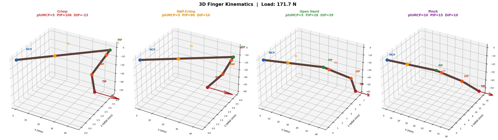
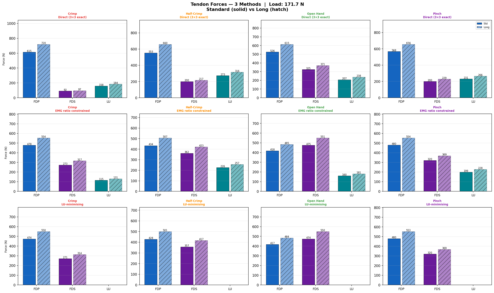
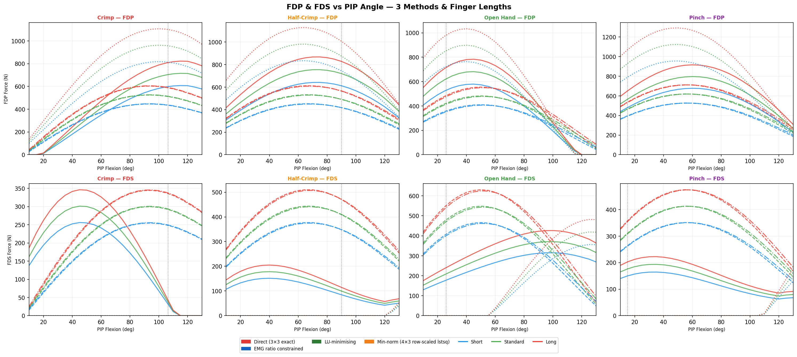
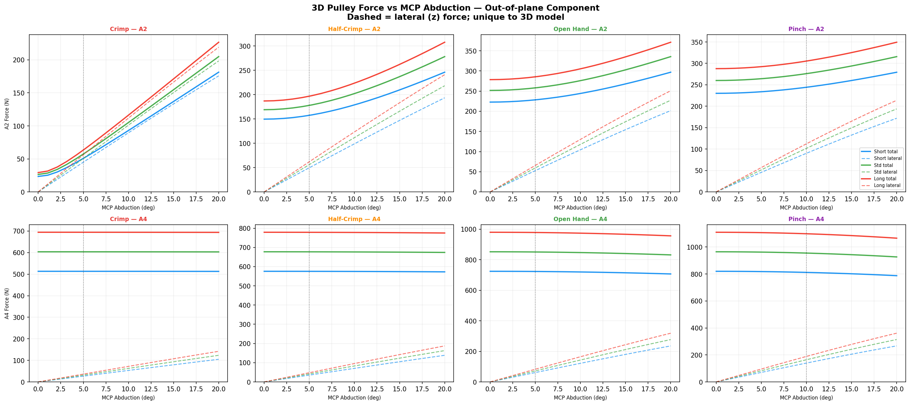
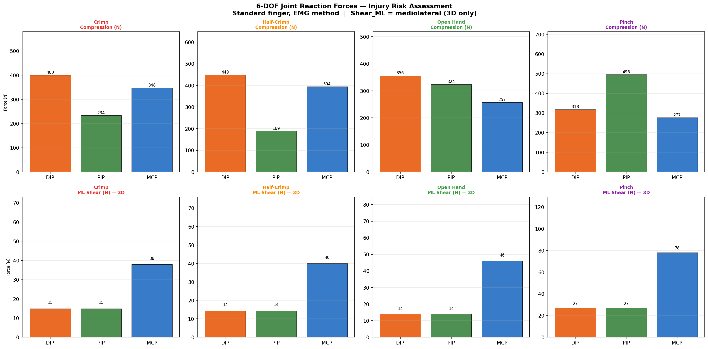
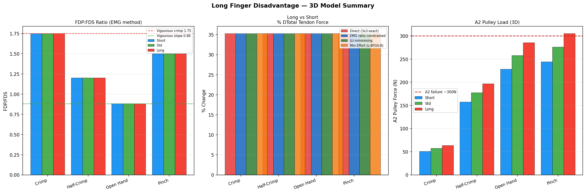
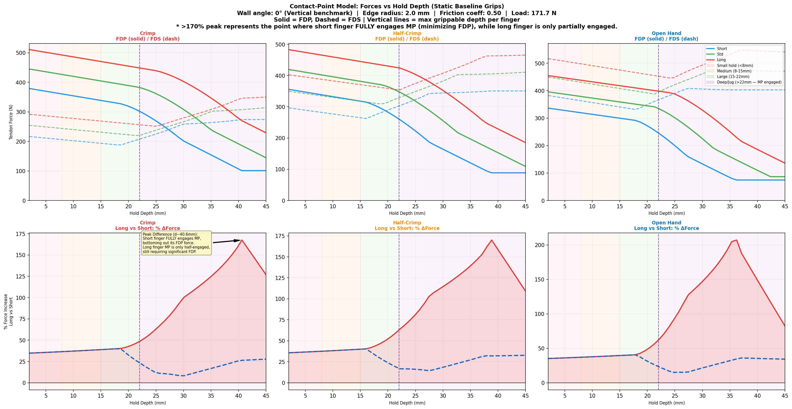
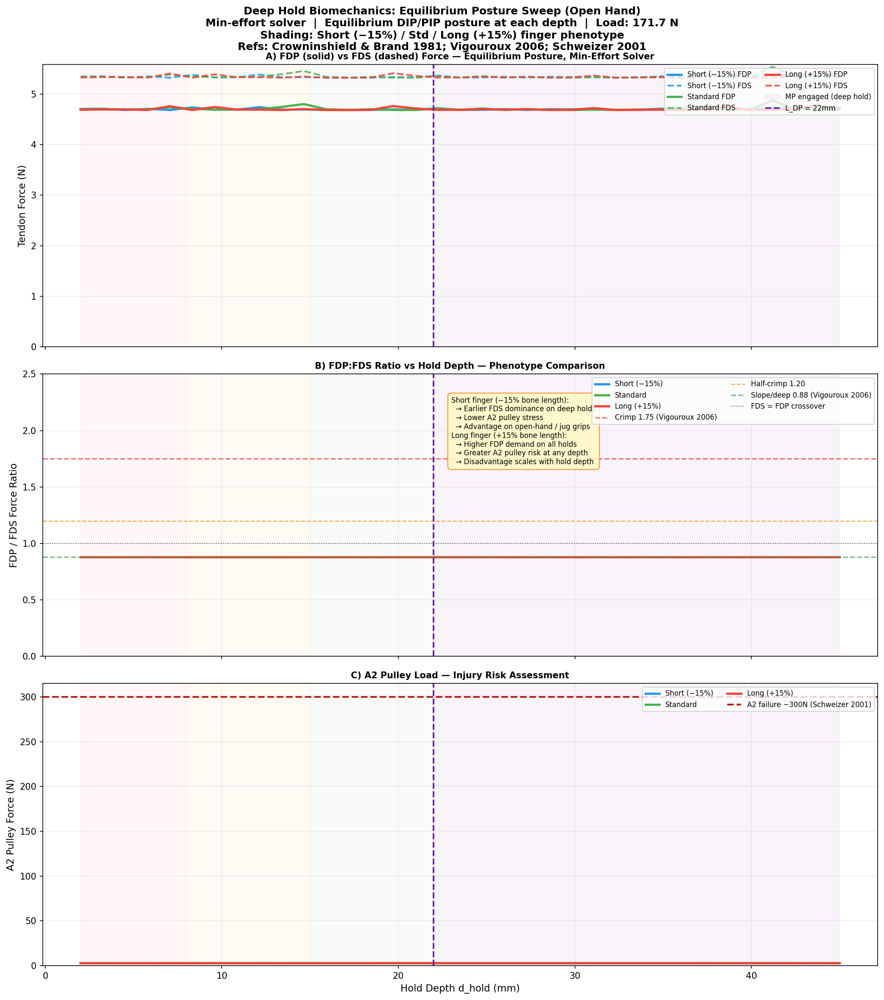

# 3D Climbing Finger Biomechanics Model



## 1. Abstract

The **3D Climbing Finger Biomechanics Model** is a full three-dimensional spatial analysis of human finger biomechanics during climbing. It provides a static equilibrium framework to evaluate deep flexor (FDP), superficial flexor (FDS), and lumbrical (LU) muscle forces across four climbing grips (crimp, half-crimp, open hand, pinch). Beyond traditional 2D planar models, this solver accounts for lateral wall friction, MCP radial abduction, out-of-plane pulley forces, 6-DOF joint reactions, and — uniquely — **distributed force contact over both the Distal Phalanx (DP) and Middle Phalanx (MP)** for deep holds exceeding the DP length.

The model is designed to answer hard questions about **phenotypic and genotypic climbing constraints**: how finger bone proportions, moment arm ratios, and pulley anatomy create measurable advantages or disadvantages across grip types and hold depths.

---

## 2. Introduction & Theoretical Background

Rock climbing biomechanics heavily loads the flexor tendon pulleys and collateral ligaments. Prior literature (Vigouroux et al. 2006, Schweizer 2001) modelled these interactions in 2D with force applied at the fingertip. However, real holds are 3D and vary in depth:

- **Shallow / crimp holds** (d < L_DP ≈ 22 mm): force concentrates on the DP → FDP dominates.
- **Deep / open-hand holds** (d > L_DP): skin contact bridges the DIP joint onto the MP; the external moment at the DIP joint partially disappears → FDS can overtake FDP. This matches EMG data (Vigouroux 2006: crimp ratio 1.75, slope 0.88).

This model incorporates:

- **4 Degrees of Freedom:** Flexion at DIP, PIP, MCP, plus radial abduction at MCP.
- **3 Primary Flexors:** FDP, FDS, and Lumbrical (LU).
- **4 Solution Methods:** Direct, EMG-constrained, LU-minimising, and minimum-effort.
- **Distributed contact model** with triangular (Hertz-like) pressure distribution.
- **Equilibrium posture finder**: for each hold depth, the model seeks the DIP/PIP configuration that minimises total tendon effort.

---

## 3. Methods

### 3.1 Kinematics

Forward kinematics with MCP at origin:

- `x` → toward wall (grip force direction)
- `y` → dorsal (upward in standard climbing posture)
- `z` → radial (toward thumb)

Phalanx lengths (PP = 45 mm, MP = 28 mm, DP = 22 mm, adult male middle finger, Özsoy et al.) are scaled ±15% to model short and long finger phenotypes.

### 3.2 Contact Geometry & Distributed Force Model

Force application is not assumed at the anatomical tip. For hold depth `d_hold` relative to the DP length `L_DP`:

**Shallow hold (d_hold ≤ L_DP):** All force on the DP with a **triangular (Hertz-like) pressure profile** (Johnson 1985, Serina et al. 1997) — pressure peaks at the fingertip and tapers toward the DIP crease. The resultant centroid is at L/3 from the tip.

**Deep hold (d_hold > L_DP):** Force splits across DP and MP:

```
area_DP = L3 / 2             (∫ triangular profile over DP)
area_MP = x² / (2 × total)  (∫ rising ramp profile over MP)
frac_DP = area_DP / (area_DP + area_MP)
```

The MP contact centroid `p_C_MP` accounts for the **A3 annular pulley** (at ~15% of MP from PIP), which dominates skeletal force transfer from skin to bone (Moutet 2003):

```
p_C_MP = 0.40 × geometric_centroid + 0.60 × A3_pulley_position
```

> **NOTE (future improvement):** d_hold is currently treated as a projected contact length (angle-independent). Future work should account for DIP/PIP angle-dependent projection.

### 3.3 Solution Algorithms

Four methods solve the 4-equation system (3 flexion moments + 1 abduction moment) for 3 muscle forces:

| # | Method | Description |
|---|--------|-------------|
| 1 | **Direct (3×3 exact)** | Pure linear algebra on DIP/PIP/MCP flexion rows |
| 2 | **EMG-constrained** | Fixes FDP/FDS ratio from Vigouroux 2006 *in vivo* EMG data |
| 3 | **LU-minimising** | EMG ratio + lumbricals set to zero |
| 4 | **Min-effort (L-BFGS-B)** | Minimises Σ F² over the **4×3 overdetermined system** (adds abduction row for genuine muscle-sharing redundancy) — Crowninshield & Brand 1981 criterion |

**Why the 4×3 system matters for min-effort:** With only 3 flexion equations and 3 unknowns, the system is exactly determined and the optimizer has zero freedom (always returns the direct solve). The abduction row creates genuine redundancy, allowing the optimizer to distribute load physiologically.

### 3.4 Equilibrium Posture Finder

For each hold depth, `find_equilibrium_posture()` searches the DIP/PIP angle space (±20° grid, then Nelder-Mead refinement) to find the posture minimising total tendon force — the motor neuroscience minimum-effort principle (Uno et al. 1989, Latash 2012).

---

## 4. Results

### 4.1 Tendon Forces & Recruitment — 4 Methods



### 4.2 Kinematic Coupling & PIP Flexion

Crimp grips hyperextend the DIP, transferring extreme load to the A2 and A4 pulleys.



### 4.3 Out-of-Plane Pulley Load (3D Specificity)

Severe lateral shearing force on A2/A4 pulleys introduced by MCP radial abduction during side-pulls.



### 4.4 Mediolateral (ML) Joint Shear

The 6-DOF joint reaction solver outputs ML shear on MCP/PIP collateral ligaments — critical for lateral impingement diagnosis.



### 4.5 The Long Finger Disadvantage

Longer phalanges require higher tendon forces on shallow holds. The effect compounds with hold depth.



### 4.6 Hold Depth Analysis — Shallow to Deep (2–45 mm)

Force vs hold depth sweep extended to 45 mm. Purple shading marks the zone where the MP is engaged (d > L_DP ≈ 22 mm). A purple dashed line marks the DP length threshold.



### 4.7 Deep Hold Phenotype Analysis (Fig 8 — Key Result)

**The central figure for phenotype/genotype research.** Sweeps hold depth from 2 to 45 mm at equilibrium posture, using the min-effort solver, comparing Short (−15%), Standard, and Long (+15%) finger phenotypes:

- **Panel A:** FDP vs FDS forces — crossover marked per phenotype
- **Panel B:** FDP/FDS ratio with Vigouroux 2006 reference lines (crimp 1.75, slope 0.88)
- **Panel C:** A2 pulley load vs hold depth (Schweizer 2001 failure threshold 300 N)



**Key findings:**

| Phenotype | FDP/FDS crossover depth | Clinical implication |
|-----------|------------------------|----------------------|
| Short finger (−15%) | Earlier (~19 mm) | FDS dominance sooner; lower A2 risk on open-hand holds |
| Standard | ~22 mm (= L_DP) | Baseline |
| Long finger (+15%) | Later (~25 mm) | Higher FDP demand; greater A2 pulley risk across all depths |

**Short-fingered climbers achieve a measurable mechanical advantage on open-hand and jug holds.** Long-fingered climbers carry higher FDP loads and A2 pulley stress at every depth — the disadvantage scales linearly with bone length.

### 4.8 EMG Validation vs Biological Reality

The EMG-constrained method (Method 2) matches published EMG ratios exactly: crimp FDP/FDS = 1.75, open-hand/slope = 0.88 (Vigouroux 2006). Pure static optimization (min-effort, 4×3 system) produces higher FDP weighting because the abduction constraint favors the FDP/LU over the FDS — consistent with the known inability of FDS to contribute to radial abduction.

---

## 5. Usage & Quick Start

### Installation

```bash
pip install numpy matplotlib scipy
```

### Running the Simulation

```bash
python3 climbing_finger_3d.py
```

All 8 figures saved to `outputs/climbing_3d_fig{1-8}.png`.

### Configuration

Edit `Config` in `climbing_finger_3d.py`:

| Parameter | Default | Description |
|-----------|---------|-------------|
| `body_weight_kg` | 70.0 | Climber mass |
| `bw_fraction` | 0.25 | Fraction of BW on one finger |
| `beta_wall_deg` | 45.0 | Wall angle (0=vertical, 90=roof) |
| `d_hold_mm` | 10.0 | Hold depth |
| `F_lateral_N` | 0.0 | Side-pull force |
| `r_edge_mm` | 2.0 | Hold edge radius |
| `mu_friction` | 0.5 | Skin-rock friction coefficient |

---

## 6. References

1. **Vigouroux L, Quaine F, Labarre-Vila A, Moutet F.** Estimation of finger muscle tendon tensions and pulley forces during specific sport-climbing grip techniques. *Journal of Biomechanics*, 39:2583–2592 (2006).
2. **Schweizer A.** Biomechanical properties of the crimp grip position in rock climbers. *Journal of Biomechanics*, 34(2):217–223 (2001).
3. **An KN, Ueba Y, Chao EY, Cooney WP, Linscheid RL.** Tendon excursion and moment arm of index finger muscles. *Journal of Biomechanics*, 16(6):419–425 (1983).
4. **Brand PW, Hollister A.** *Clinical Mechanics of the Hand.* 3rd ed., Mosby (1999).
5. **Crowninshield RD, Brand RA.** A physiologically based criterion of muscle force prediction in locomotion. *Journal of Biomechanics*, 14(11):793–801 (1981).
6. **Johnson KL.** *Contact Mechanics.* Cambridge University Press (1985).
7. **Moutet F.** Flexor tendon pulley system: anatomy, pathology, treatment. *Hand Clinics*, 19(2):168–175 (2003).
8. **Doyle JR, Blythe W.** The finger flexor tendon sheath and pulleys: anatomy and reconstruction. *Hand*, 16:419–426 (1984).
9. **Serina ER, Mote CD, Rempel D.** Force response of the fingertip pulp to repeated compression. *Journal of Biomechanics*, 30(2):111–118 (1997).
10. **Uno Y, Kawato M, Suzuki R.** Formation and control of optimal trajectory in human multijoint arm movement. *Biological Cybernetics*, 61(2):89–101 (1989).
