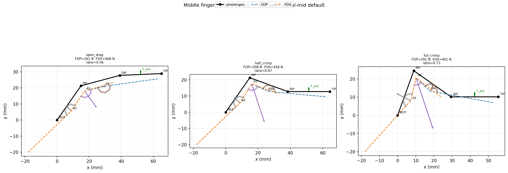
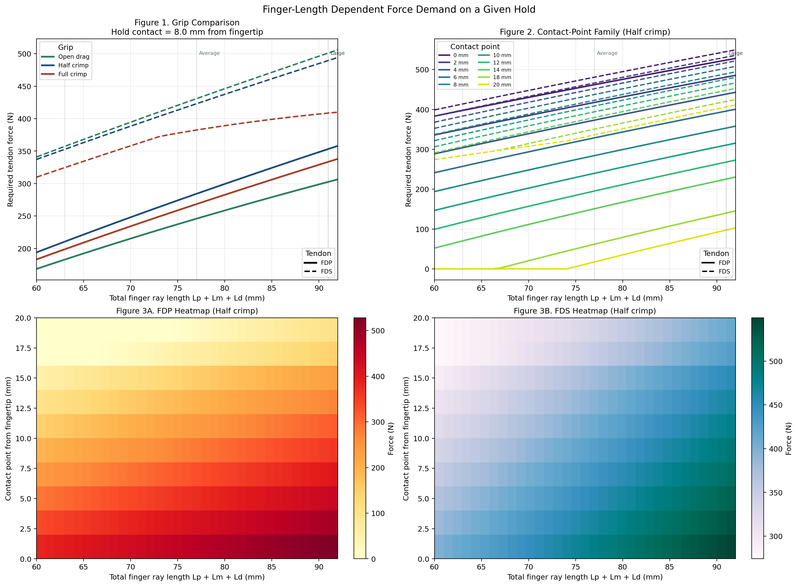

# Middle Finger Climbing Biomechanics

Reduced 2D biomechanics model of the middle finger for climbing grip analysis.





## Overview

The current code is intentionally narrower than the original prototype. Unsupported mechanics were removed or downgraded after benchmarking against published studies.

Use this repository to:

- comparing FDP and FDS force demand across finger lengths
- comparing open drag, half crimp, and full crimp postures
- visualizing finger geometry, tendon paths, and pulley reaction vectors
- checking whether a change in finger length produces a biomechanical advantage or disadvantage

The current code is **not** a fully validated hand model. It reproduces some published trends, but it does not yet match all published absolute values.

## Quick Start

```bash
python3 finger_biomechanics_model.py
python3 finger_biomechanics_model.py --load-point-mm-from-tip 0
python3 plot_length_vs_force_peerj.py
python3 plot_length_vs_force_peerj.py --contact-sweep-grip full_crimp --load-point-mm-from-tip 6
```

Generated images are written to `img/`.

## Methods

`finger_biomechanics_model.py` implements a reduced planar model of the middle finger with:

- three phalanges (`Lp`, `Lm`, `Ld`) and configurable joint posture
- FDP insertion on the distal phalanx and FDS insertion on the middle phalanx
- annular pulley redirection at A2, A3, and A4
- DIP and PIP static equilibrium for FDP and FDS
- passive DIP/PIP resistance
- external load applied in global `+y`

The load/hold is defined by a contact point measured proximally from the fingertip along the distal phalanx:

- `0 mm` = fingertip loading
- `Ld / 2` = distal-phalanx midpoint
- values above `Ld` are clipped to the DIP end

The default grip presets are:

- `open_drag`
- `half_crimp`
- `full_crimp`

The study plot in `plot_length_vs_force_peerj.py` uses the same solver to sweep finger length and hold contact point.

## Study Figures

`plot_length_vs_force_peerj.py` produces three figures in one image:

- Figure 1: all three major grip types on one force-vs-length plot for one fixed hold/contact point
- Figure 2: contact-point family of curves for `0, 2, 4, 6, 8, 10, 12, 14, 18, 20 mm` from the fingertip for one selected grip
- Figure 3: FDP and FDS heatmaps over finger length and contact distance for the selected grip

Use:

```bash
python3 plot_length_vs_force_peerj.py
python3 plot_length_vs_force_peerj.py --contact-sweep-grip full_crimp --load-point-mm-from-tip 6
```

Interpretation:

- rising force with increasing finger length indicates a mechanical disadvantage for that grip/hold definition
- changing contact distance changes the external moment arm and therefore the FDP/FDS demand
- the heatmaps show where the disadvantage is strongest across the full length/contact space

## Benchmark Summary

The model is benchmarked against three published anchors:

- Vigouroux et al. 2006: FDP/FDS ratio in open-hand vs crimp postures
- Schweizer 2009: A2 and A4 pulley loads at 100 N fingertip load
- PeerJ 7470: longer fingers gain only modest moment-arm advantage and still require higher flexor force

Current status for the average-climber fingertip case:

- `open_drag` FDP/FDS is close to the Vigouroux open-hand value
- `full_crimp` FDP/FDS remains below the Vigouroux crimp value
- A2 is overpredicted relative to Schweizer 2009
- A4 is not matched consistently across all grips
- the PeerJ length-disadvantage trend is reproduced

## Scope And Limits

This repository is useful for:

- relative comparison of short vs long fingers under the same assumptions
- posture-to-posture comparison of FDP/FDS demand
- visualization of tendon routing and pulley reaction directions
- hold/contact sensitivity studies using the fingertip-distance parameter

It should not be used as evidence for:

- exact human pulley-load magnitudes
- exact proximal flexor moment arms
- MCP or extensor equilibrium
- fatigue or multi-finger force sharing

Unsupported additions from the earlier prototype were removed from the active model path, including MCP closure, EDC loading, fatigue, four-finger sharing, and post-hoc calibration.

## Files

- main model: `finger_biomechanics_model.py`
- study plot: `plot_length_vs_force_peerj.py`
- generated images: `img/`
- finger-geometry figure: `img/finger_biomechanics_forces.png`
- study figure: `img/plot_length_vs_force_peerj_study_half_crimp_8p0mm.png`

## References

- Vigouroux, Quaine, Labarre-Vila, Moutet, J Biomech (2006): [https://doi.org/10.1016/j.jbiomech.2005.10.034](https://doi.org/10.1016/j.jbiomech.2005.10.034)
- Schweizer, J Hand Surg Am (2001): [https://doi.org/10.1053/jhsu.2001.26322](https://doi.org/10.1053/jhsu.2001.26322)
- Schweizer, J Biomech (2009): [https://pubmed.ncbi.nlm.nih.gov/19367698/](https://pubmed.ncbi.nlm.nih.gov/19367698/)
- PeerJ 7470: [https://peerj.com/articles/7470/](https://peerj.com/articles/7470/)
- Minami et al., J Hand Surg (1985): passive finger-joint stiffness
- An et al., J Biomech (1983): tendon-excursion moment-arm method
