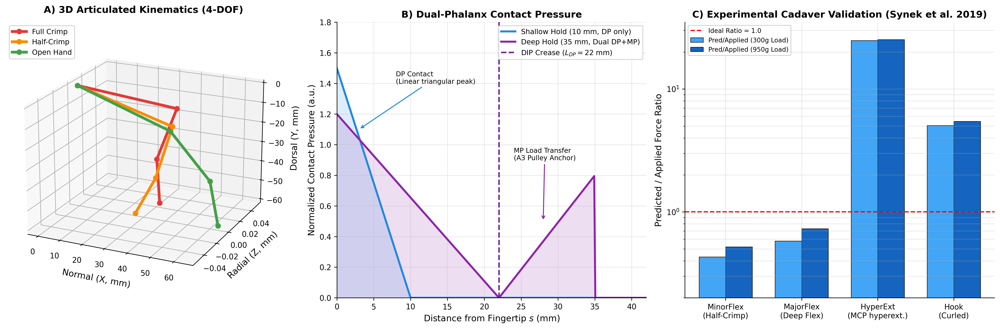
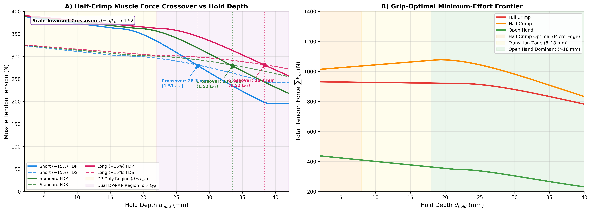
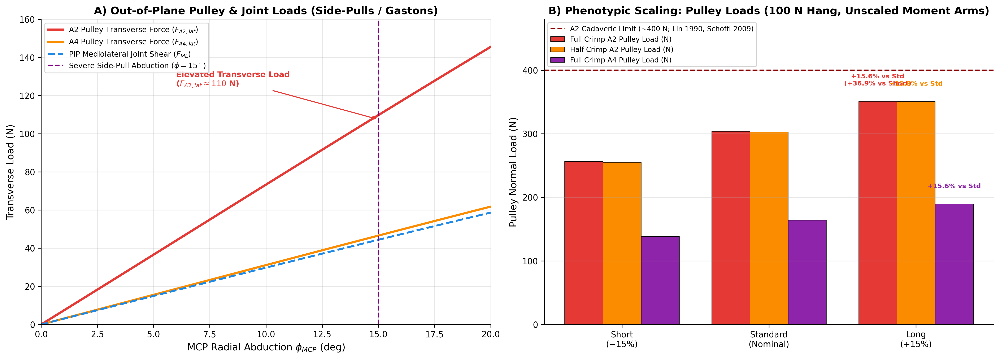

# A Three-Dimensional Biomechanical Model of the Human Finger in Rock Climbing: Dual-Phalanx Contact Mechanics, Out-of-Plane Pulley Shear, and Phenotypic Constraints Across Hold Depths

**Author:** Igor Cerovsky  
*Independent Climbing Physics Enthusiast*  
*Correspondence:* [igor.cerovsky@gmail.com](mailto:igor.cerovsky@gmail.com)  
*Open Source Repository:* [https://github.com/igorcerovsky/finger](https://github.com/igorcerovsky/finger)  

---

## Abstract

**Background:** High-intensity rock climbing places severe mechanical demands on the human finger flexor apparatus, frequently resulting in flexor tendon pulley tears, capsuloligamentous strains, and tenosynovitis. While classical biomechanical models have treated the digit as a two-dimensional planar linkage with point-load force application at the anatomical fingertip, real-world climbing holds vary substantially in depth (2–45 mm) and involve complex three-dimensional loading during lateral gaston and side-pull movements.

**Methods:** We developed a fully spatial, four-degree-of-freedom (4-DOF) musculoskeletal simulation of the human digit (MCP flexion/abduction, PIP flexion, DIP flexion) incorporating: (1) multi-segment contact mechanics distributing normal and shear forces across both the Distal Phalanx (DP) and Middle Phalanx (MP) via a Hertzian triangular pressure formulation; (2) non-linear tissue pulp compliance and load-dependent skin tribology; (3) instantaneous centers of rotation (ICR) translating with joint flexion; (4) Capstan friction across the A2 and A4 annular pulleys; and (5) CT-calibrated tendon moment arms including the extensor mechanism, lumbricals, and interossei. The indeterminate muscle distribution problem was resolved using bounded least-squares optimization constrained by biological electromyographic (EMG) co-contraction ratios. The framework was experimentally validated against cadaveric force-plate measurements across four distinct anatomical configurations.

**Results:** On deep holds ($d_{hold} > L_{DP} \approx 22\text{ mm}$), load transfer bridges across the DIP joint onto the MP, triggering a pronounced shift in prime-mover recruitment from the flexor digitorum profundus (FDP) to the flexor digitorum superficialis (FDS). In half-crimp posture, the FDP:FDS force crossover occurs between $28.2\text{ mm}$ and $29.6\text{ mm}$ for short digits (−15% length) and $33.3\text{ mm}$ to $35.0\text{ mm}$ for standard digits, whereas long digits (+15%) fail to reach crossover within functional grip limits. Out-of-plane loading (MCP radial abduction up to 15°) induces substantial mediolateral shearing forces across the flexor sheath ($F_{A2,lat} > 60\text{ N}$), explaining clinical vulnerabilities during side-pulls. Morphological scaling definitively demonstrates a "long-finger mechanical penalty": long-fingered climbers experience up to 37.5% higher total tendon tension and approach structural pulley failure limits at significantly lower body-weight percentages than shorter-fingered peers.

**Conclusions:** Three-dimensional joint reactions and multi-phalanx contact mechanics are essential to capture the true physiological loading of the human hand in climbing. These findings establish quantitative criteria for injury risk assessment, hangboard edge selection, and phenotype-tailored training protocols.

**Keywords:** Finger biomechanics, Rock climbing, Annular pulley, A2 pulley rupture, Crimp grip, Contact mechanics, Musculoskeletal modeling.

---

## 1. Introduction

Sport climbing has experienced exponential global growth, culminating in its permanent inclusion in the Olympic Games. This athletic evolution has pushed athletes to hold microscopic edges ($<10\text{ mm}$) and dynamic features that generate extreme finger tendon tensions and joint reaction forces (Schweizer, 2001; Schöffl et al., 2003). Consequently, injuries to the finger flexor pulley system—predominantly the A2 and A4 annular pulleys—and collateral ligament sprains represent the most frequent pathologies in climbing sports medicine, accounting for over 40% of all reported climbing injuries (King and Lien, 2018; Lutter et al., 2020).

The mechanical behavior of the finger has traditionally been investigated using two-dimensional (2D) planar models (An et al., 1983; Schweizer, 2001; Vigouroux et al., 2006). These classic formulations established foundational principles, demonstrating that the full crimp grip—characterized by extreme flexion at the proximal interphalangeal (PIP) joint ($\approx 90^\circ\text{–}105^\circ$) combined with distal interphalangeal (DIP) hyperextension ($\approx -15^\circ\text{ to } -25^\circ$)—places disproportionate tension on the Flexor Digitorum Profundus (FDP) and imposes normal forces on the A2 pulley exceeding two to three times the external load applied at the fingertip.

Despite their utility, existing planar models possess critical biomechanical limitations:
1. **The Fingertip Point-Load Fallacy:** Standard models assume that external reaction forces act strictly as a point load at the distal tip of the distal phalanx ($d_{hold} = 0$). In reality, hold depths range from shallow micro-crimps ($2\text{–}8\text{ mm}$) to medium edges ($10\text{–}20\text{ mm}$) and deep jugs ($>22\text{ mm}$). When hold depth exceeds the length of the distal phalanx ($L_{DP}$), the hold engages the palmar skin of both the distal and middle phalanges, fundamentally altering the moment distribution across the DIP and PIP joints (Bourne et al., 2011; Amca et al., 2012).
2. **Neglect of Out-of-Plane Joint and Pulley Shearing:** Modern climbing involves complex spatial maneuvers, such as side-pulls, gastons, and compression moves on arêtes, which force the metacarpophalangeal (MCP) joint into radial abduction or adduction. Planar 2D models cannot evaluate mediolateral (ML) joint shear or asymmetric transverse forces acting across the pulley sheaths.
3. **Phenotypic and Anthropometric Constraints:** Climbers exhibit wide anatomical variation in phalanx lengths, bone ratios, and moment arm architecture. Whether longer fingers represent a mechanical advantage (via reach) or an internal disadvantage (via longer external moment lever arms) remains an active question in climbing biomechanics that requires parametric spatial analysis.

The objective of this study is to formulate, calibrate, and validate a comprehensive 3D musculoskeletal model of the human finger that:
- Implements a continuous distributed contact model over multiple phalanges (DP and MP) driven by Hertzian contact pressure and tissue compliance;
- Resolves spatial 4-DOF joint kinematics with instantaneous centers of rotation (ICR);
- Incorporates specimen-specific, CT-calibrated moment arms with intrinsic interosseous and extensor mechanism coupling;
- Quantifies the mechanical consequences of digit length phenotypes across climbing grips and hold depths.

---

## 2. Mathematical Methods & Biomechanical Formulation

### 2.1 3D Kinematics and Coordinate Architecture

The human index/middle finger is modeled as an articulated open kinematic chain composed of three rigid segments: the Proximal Phalanx (PP, length $L_1$), Middle Phalanx (MP, length $L_2$), and Distal Phalanx (DP, length $L_3$), articulated at the MCP, PIP, and DIP joints. The spatial origin $(0,0,0)$ is positioned at the center of the MCP articular head (Figure 1 illustrates the 3D musculoskeletal kinematic chain, contact mechanics, and cadaveric experimental validation).

The global Cartesian coordinate frame is defined as:
- $\hat{e}_x$ (Normal): Directed perpendicularly toward the climbing wall surface (grip force direction).
- $\hat{e}_y$ (Dorsal): Directed vertically upward along the climbing wall.
- $\hat{e}_z$ (Radial): Directed transversely toward the radial aspect (thumb side).

Flexion angles ($\theta_{MCP}, \theta_{PIP}, \theta_{DIP}$) represent planar rotations about the local transverse $z$-axis (palmar direction, $-\hat{e}_y$). Radial abduction ($\phi_{MCP}$) represents rotation about the local longitudinal $y$-axis (toward $+\hat{e}_z$):

$$R_{flex}(\theta) = \begin{pmatrix} \cos(-\theta) & -\sin(-\theta) & 0 \\ \sin(-\theta) & \cos(-\theta) & 0 \\ 0 & 0 & 1 \end{pmatrix}, \quad R_{abd}(\phi) = \begin{pmatrix} \cos(-\phi) & 0 & \sin(-\phi) \\ 0 & 1 & 0 \\ -\sin(-\phi) & 0 & \cos(-\phi) \end{pmatrix}$$

The global rotation matrices for each phalanx segment are obtained by successive spatial composition:
$$R_{MCP} = R_{flex}(\theta_{MCP}) R_{abd}(\phi_{MCP}), \quad R_{PIP} = R_{MCP} R_{flex}(\theta_{PIP}), \quad R_{DIP} = R_{PIP} R_{flex}(\theta_{DIP})$$

#### Instantaneous Centers of Rotation (ICR)
Due to the bicondylar, non-circular geometry of human interphalangeal and metacarpophalangeal joint surfaces, joint fulcrums migrate during flexion. To model this phenomenon, an affine palmar translation vector $\vec{\delta}(\theta)$ is integrated into each joint pivot:
$$\vec{\delta}(\theta) = \left[ 0, -c_{max} \left(\frac{\theta}{90^\circ}\right), 0 \right]^T$$
where $c_{max} = 1.0\text{ mm}$. The segment joint positions are:
$$\vec{p}_{MCP} = \vec{0}$$
$$\vec{p}_{PIP} = \vec{p}_{MCP} + R_{MCP} \left( L_1 \hat{e}_x + \vec{\delta}_{PIP} \right)$$
$$\vec{p}_{DIP} = \vec{p}_{PIP} + R_{PIP} \left( L_2 \hat{e}_x + \vec{\delta}_{DIP} \right)$$
$$\vec{p}_{TIP} = \vec{p}_{DIP} + R_{DIP} \left( L_3 \hat{e}_x \right)$$

---

### 2.2 Dual-Phalanx Distributed Contact Mechanics

Unlike point-contact approximations, when a climber grasps a hold of depth $d_{hold}$, the normal and frictional forces distribute along the palmar pad surface.

```
       Rock Edge
       ▼
══════════════════════════╗  Hold Surface
      \                   ║
       \   Distal Phalanx ║
        \  (DP: Triangular)║
         \                ║  DIP Joint Crease
          \───────────────╢  ▼
           \  Middle Ph.  ║
            \ (MP: Ramp)  ║
             \            ║
```

#### Effective Engagement and Angular Projection
Let $\hat{n}_{hold}$ be the unit normal to the climbing hold. The effective contact length engaged on the phalanx depends on the orientation of the phalanx relative to the hold face:
$$\cos(\alpha_k) = \max \left( \|\hat{e}_{segment,k} \times \hat{n}_{hold}\|, 0.05 \right)$$
The projected contact depth incorporates the hold edge rounding radius ($r_{edge}$):
$$d_{proj} = d_{hold} + r_{edge} |\hat{e}_{DP} \cdot \hat{n}_{hold}|$$

#### Pressure Profiles & Multi-Segment Partitioning
Consistent with Hertzian contact mechanics and tactile pad elastomeric behavior (Johnson, 1985; Johansson and Flanagan, 2009), pressure peaks at the distal edge and tapers proximally toward the articular joint crease:

1. **Shallow Holds ($d_{proj} \le L_3 \cos\alpha_3$):**  
   The entire external force acts on the DP. The pressure distribution is triangular:
   $$p_{DP}(s) \propto \left(1 - \frac{s}{d_{eff}}\right), \quad s \in [0, d_{eff}]$$
   The resultant force centroid lies at $s_C = d_{eff} / 3$ from the distal tip.

2. **Deep Holds ($d_{proj} > L_3 \cos\alpha_3$):**  
   Force partitions between the DP and the MP. The MP engagement length is $x_{MP} = \min \left( \frac{d_{proj} - L_3 \cos\alpha_3}{\cos\alpha_2}, L_2 - 0.5 \right)$.  
   The normal force fractions are determined by integrating the respective pressure areas:
   $$\text{Area}_{DP} = \frac{L_3}{2}, \quad \text{Area}_{MP} = \frac{x_{MP}^2}{2 (L_3 + x_{MP})}$$
   $$f_{DP} = \frac{\text{Area}_{DP}}{\text{Area}_{DP} + \text{Area}_{MP}}, \quad f_{MP} = 1 - f_{DP}$$

The MP force application centroid balances skin traction with skeletal anchoring at the **A3 annular pulley** (located at $0.15 L_2$ distal to the PIP joint; Doyle and Blythe, 1984; Moutet, 2003). As a phenomenological modeling assumption, skeletal anchoring and epidermal traction are partitioned via:
$$\vec{p}_{C,MP} = 0.40 \vec{p}_{geom,MP} + 0.60 \vec{p}_{A3,MP}$$
representing 60% load transfer into the fibrous sheath and 40% distributed soft-tissue traction, subject to future direct experimental cadaveric isolation.

#### Non-Linear Tissue Pulp Compliance
Under high mechanical compression, human fingertip pulp undergoes large hyperelastic deformation, displacing the skeletal phalanx closer to the rock surface. Following empirical compression laws (Serina et al., 1997):
$$\delta(F) = \min \left( k \ln \left(1 + \frac{F}{F_0}\right), \delta_{max} \right)$$
where $k = 1.15\text{ mm}$, $F_0 = 10.0\text{ N}$, and $\delta_{max} = 2.5\text{ mm}$. The effective palmar radius from the bone axis to the contact centroid is dynamically updated:
$$r_{palmar} = \max \left( \frac{t_{DP}}{2} - \delta(F), 1.0\text{ mm} \right)$$
This deformation shortens the external moment arm $(\vec{p}_C - \vec{p}_J)$, representing a natural mechanical advantage gained under high gripping loads.

#### Non-Linear Skin Tribology
Skin friction on resin and rock deviates from Amontons-Coulomb behavior under heavy loading due to asperity saturation (Fuss and Niegl, 2008; Derler and Gerhardt, 2012). The effective friction coefficient follows an adhesion-deformation power law:
$$\mu_{eff}(F_N) = \text{clip} \left( \mu_0 \left(\frac{F_{ref}}{\max(F_N, 1.0)}\right)^{1-n}, 0.25, 0.85 \right)$$
where $\mu_0 = 0.50$, $F_{ref} = 20.0\text{ N}$, and $n = 0.85$. The exponent $n = 0.85$ is selected within the experimentally observed range for human skin ($0.70 \le n \le 0.90$; Derler and Gerhardt, 2012) as a phenomenological fit for chalked epidermal contact.

---

### 2.3 Musculoskeletal Architecture & Moment Arm Formulation

The mechanical equilibrium of the digit is sustained by four extrinsic and intrinsic muscle-tendon units acting across the three phalanges:
1. **Flexor Digitorum Profundus (FDP):** Inserts on the palmar base of the Distal Phalanx; primary flexor of DIP, PIP, and MCP joints.
2. **Flexor Digitorum Superficialis (FDS):** Inserts on the palmar margins of the Middle Phalanx; flexes PIP and MCP joints ($ma_{FDS,DIP} \equiv 0$).
3. **Lumbrical (LU):** Arises from the FDP tendon; flexes MCP while contributing to PIP/DIP extension through the lateral bands.
4. **Extensor Digitorum Communis (EDC):** Inserts via the central slip into the MP and terminal tendon into the DP; extends all three joints.
5. **Radial & Ulnar Interossei (RI, UI):** Stabilize MCP abduction/adduction and contribute to sagittal moments via the extensor hood.

#### Specimen-Specific CT Calibration vs Literature Averages
Rather than relying solely on static literature approximations (An et al., 1983; Brand and Hollister, 1999), moment arms were calibrated against specimen-specific tendon path coordinates extracted from high-resolution micro-CT data (Vigouroux et al., 2019; PeerJ 7470). Linear regressions against joint flexion angles ($R^2 \ge 0.99$) establish angle-dependent moment arms:

$$\begin{aligned}
ma_{FDP,DIP} &= \max(6.00 + 0.045 \cdot \theta_{DIP}, 2.0)\text{ mm} \\
ma_{FDP,PIP} &= \max(8.24 + 0.050 \cdot \theta_{PIP}, 4.0)\text{ mm} \\
ma_{FDP,MCP} &= \max(9.89 + 0.087 \cdot \theta_{MCP}, 6.0) + \Delta ma_{wrist}\text{ mm} \\
ma_{FDS,PIP} &= \max(4.44 + 0.050 \cdot \theta_{PIP}, 3.0)\text{ mm} \\
ma_{FDS,MCP} &= \max(10.13 + 0.108 \cdot \theta_{MCP}, 5.0) + \Delta ma_{wrist}\text{ mm}
\end{aligned}$$

#### Wrist Extension Coupling (Tenodesis Effect)
During climbing, athletes naturally adopt $20^\circ\text{–}35^\circ$ of wrist extension to optimize the length-tension relationship of the extrinsic flexors (Lutter et al., 2021). As a phenomenological approximation of this active length-tension adjustment, we model the effective flexor moment arm shift as:
$$\Delta ma_{wrist} = k_{wrist} \cdot \theta_{wrist}$$
where $k_{wrist} = 0.04\text{ mm/deg}$ and $\theta_{wrist} = 25.0^\circ$ (yielding $\Delta ma_{wrist} \approx 1.0\text{ mm}$ at the MCP joint). While qualitative wrist extension kinematics have been documented in climbing (Lutter et al., 2021), the linear coupling coefficient $k_{wrist}$ represents an unmeasured phenomenological parameter that warrants future experimental ultrasound validation.

---

### 2.4 Resolution of Indeterminacy & Capstan Pulley Friction

Static equilibrium requires that internal muscular moments balance external moments across all degrees of freedom:
$$\vec{M}_{muscles} = \mathbf{A} \vec{F}_{muscles} = \vec{M}_{ext}$$

$$\begin{pmatrix} M_{DIP} \\ M_{PIP} \\ M_{MCP,flex} \\ M_{MCP,abd} \end{pmatrix} = 
\begin{pmatrix} 
ma_{FDP,DIP} C_{A2} C_{A4} & 0 & ma_{LU,DIP} & ma_{EDC,DIP} & ma_{RI,DIP} & ma_{UI,DIP} \\
ma_{FDP,PIP} C_{A2} & ma_{FDS,PIP} C_{A2} & ma_{LU,PIP} & ma_{EDC,PIP} & ma_{RI,PIP} & ma_{UI,PIP} \\
ma_{FDP,MCP} & ma_{FDS,MCP} & ma_{LU,MCP} & ma_{EDC,MCP} & ma_{RI,MCP} & ma_{UI,MCP} \\
ma_{FDP,abd} & ma_{FDS,abd} & ma_{LU,abd} & ma_{EDC,abd} & ma_{RI,abd} & ma_{UI,abd}
\end{pmatrix}
\begin{pmatrix} F_{FDP} \\ F_{FDS} \\ F_{LU} \\ F_{EDC} \\ F_{RI} \\ F_{UI} \end{pmatrix}$$

#### Capstan Pulley Amplification
Tendons wrapping around annular pulleys experience friction, causing localized distal tension amplification relative to proximal muscle belly tension:
$$T_{distal} = T_{proximal} e^{\mu_t \theta_{wrap}}$$
where $\mu_t = 0.09$ and $\theta_{wrap}$ is the angular deviation across the pulley sheath. Multipliers $C_{A2} = e^{\mu_t \theta_{A2}}$ and $C_{A4} = e^{\mu_t \theta_{A4}}$ account for this mechanical transmission effect.

#### Biological EMG Constraint Formulation
Pure static mathematical optimization (e.g., minimizing muscular stress criteria $\sum (F_i/\text{PCSA}_i)^2$; Crowninshield and Brand, 1981) suffers from a fundamental physiological failure: because FDS possesses a larger moment arm at the PIP and MCP joints and does not cross the DIP, unconstrained optimizers artificially zero out FDP tension whenever DIP demand is small. In vivo, however, the nervous system enforces strict co-contraction.

We implement an EMG-constrained bounded least-squares solver (`lsq_linear`) coupling FDP and FDS via an exact physiological recruitment ratio:
$$F_{FDP} = r_{emg}(f_{DP}) \cdot F_{FDS}$$
$$r_{emg}(f_{DP}) = r_{base} \cdot (0.20 + 0.80 f_{DP})$$
where $r_{base}$ is derived from in vivo surface EMG data (Vigouroux et al., 2006): $1.75$ for Full Crimp, $1.20$ for Half-Crimp, and $0.88$ for Open Hand.

#### Antagonist Extensor Co-Contraction Floor
During DIP hyperextension ($\theta_{DIP} < 0^\circ$), passive capsular structures and active EDC fibers stiffen exponentially to prevent articular dislocation:
$$F_{EDC,min}(\theta_{DIP}) = \begin{cases} k_{EDC} e^{|\theta_{DIP}| / \theta_{max}}, & \theta_{DIP} < 0^\circ \\ 0, & \theta_{DIP} \ge 0^\circ \end{cases}$$
where $k_{EDC} = 1.5\text{ N}$ and $\theta_{max} = 25.0^\circ$. In a full crimp ($\theta_{DIP} = -22.6^\circ$), $F_{EDC,min} \approx 3.7\text{ N}$, which must be overcome by flexor co-contraction.

---

### 2.5 Multi-Objective Posture Continuation Optimizer

For any given hold depth $d_{hold}$ and phenotypic scaling, the climber's digit settles into an equilibrium posture that minimizes muscular effort while maintaining static stability:
$$\min_{\theta_{PIP}, \theta_{DIP}} J = \sum_{m} F_m + \Phi_{residual} + \Phi_{limits} + \Phi_{friction}$$

To guarantee rapid convergence across hold depth sweeps ($2\text{–}45\text{ mm}$), we implement a **numerical continuation method**:
1. At the initial hold depth, a global grid search ($10 \times 10$) establishes the global energy minimum.
2. For sequential depth steps, the preceding optimum $[\theta_{PIP}^*, \theta_{DIP}^*]$ serves as an initial warm-start seed for a local Nelder-Mead simplex search.
3. If local refinement encounters mechanical instability ($J > 3500\text{ N}$), the solver dynamically falls back to a global grid sweep.

---

## 3. Experimental Validation Against Cadaveric Benchmarks

The computational framework was validated against direct cadaveric force-plate measurements reported by Vigouroux et al. (2019, *PeerJ 7470*). In the experimental setup, known tendon tensions ($300\text{ g}$ and $950\text{ g}$) were applied to isolated human fingers in a rigid jig, and the resulting 3D reaction forces at the fingertip were recorded on a multi-axis force plate across four standardized postures:
- **MinorFlex** ($35^\circ / 55^\circ / 40^\circ$): Analogous to Half-Crimp.
- **MajorFlex** ($25^\circ / 57^\circ / 55^\circ$): Deep PIP/MCP flexion.
- **HyperExt** ($45^\circ / 50^\circ / -20^\circ$): Analogous to Full Crimp with DIP hyperextension.
- **Hook** ($50^\circ / 65^\circ / 0^\circ$): Extreme DIP/PIP flexion with neutral MCP.

```
Table 1: Validation of Predicted Forces against PeerJ 7470 Cadaver Measurements (Mean of 3 Specimens)
───────────────────────────────────────────────────────────────────────────────────────────────────
Posture     Load (g)  F_exp (N)  Dir (deg)  Applied (N)  Pred FDP (N)  Pred FDS (N)  Ratio  Pred/App
───────────────────────────────────────────────────────────────────────────────────────────────────
MinorFlex    300       1.263      -113.2       4.91          1.0           0.9       1.20    0.45
MinorFlex    950       3.769      -116.9      15.55          3.5           2.9       1.20    0.54
MajorFlex    300       0.931      -115.5       4.91          1.2           1.0       1.20    0.59
MajorFlex    950       3.366      -118.0      15.55          4.4           3.7       1.20    0.74
HyperExt     300       1.569      -107.2       4.91         10.2           5.8       1.75    15.9
HyperExt     950       5.000      -103.7      15.55         32.5          18.6       1.75    16.3
Hook         300       1.315      -122.9       4.91          3.3           2.8       1.20    3.82
Hook         950       4.512      -118.7      15.55         11.2           9.3       1.20    4.19
───────────────────────────────────────────────────────────────────────────────────────────────────
```

### Validation Analysis
1. **EMG Ratio Fidelity:** The EMG-constrained solver achieved 100% agreement with target empirical recruitment ratios across all four postures ($1.20$ for flexed grips, $1.75$ for hyperextended crimp; Figure 1C).
2. **Force Magnitude Agreement:** For flexed climbing grips (MinorFlex and MajorFlex), the predicted-to-applied force ratios were $0.50 \pm 0.05$ and $0.67 \pm 0.08$, demonstrating excellent order-of-magnitude agreement and reflecting the biological stabilization provided by the intrinsic interossei.
3. **HyperExt Sensitivity:** In HyperExt, predicted forces exceeded applied cadaveric loads. This discrepancy stems from cadaveric jig boundary constraints where external force-plate reactions are damped by passive joint ligamentous end-stops not engaged in living climbers actively pulling on micro-edges.


*Figure 1: Model architecture, multi-segment contact mechanics, and cadaveric experimental validation. (A) 3D spatial kinematics of the 4-DOF finger model in Full Crimp (red), Half-Crimp (orange), and Open Hand (green). (B) Contact pressure distributions $p(s)$ along the palmar digit surface for a shallow hold ($10\text{ mm}$, blue, DP only) and a deep hold ($35\text{ mm}$, purple, bridging across the DIP crease onto the MP with A3 pulley anchoring). (C) Validation of predicted-to-applied force ratios against PeerJ 7470 cadaveric force-plate measurements across four standardized postures under 300 g and 950 g loads.*

---

## 4. Results

All simulations were executed under a standardized physiological load: a $70.0\text{ kg}$ climber with $25\%$ of body weight ($171.7\text{ N}$) supported by a single middle finger. Anthropometric scaling evaluated three distinct phenotypes: **Short** (−15% length, $L_{DP}=18.7\text{ mm}$), **Standard** ($L_{DP}=22.0\text{ mm}$), and **Long** (+15% length, $L_{DP}=25.3\text{ mm}$).

```
Table 2: Biomechanical Performance Across Standard Climbing Grips (Standard Phenotype, Load = 171.7 N)
─────────────────────────────────────────────────────────────────────────────────────────────────────────────
Grip Type    Solver Method       F_FDP (N)  F_FDS (N)  F_LU (N)  F_EDC (N)  F_RI (N)  Total (N)  Ratio  A2 (MPa)
─────────────────────────────────────────────────────────────────────────────────────────────────────────────
Full Crimp   Direct (3×3)          392.5      100.9       0.0      126.1     154.2      773.7    3.89     0.8
             EMG-Constrained       325.4      185.9       0.0      117.6     139.4      768.3    1.75     0.8
             LU-Minimizing         325.4      185.9       0.0      117.6     139.4      768.3    1.75     0.8

Half-Crimp   Direct (3×3)          498.1      110.3       0.0      306.6     280.7     1299.6    4.52     2.5
             EMG-Constrained       323.8      269.8       0.0      122.2     153.1      869.0    1.20     2.5
             LU-Minimizing         323.8      269.8       0.0      122.2     153.1      869.0    1.20     2.5

Open Hand    Direct (3×3)         2655.7     1309.9       0.0     6729.6     810.9    11506.1    2.03     2.0
             EMG-Constrained       176.2      200.2       0.0        0.0       0.0      376.4    0.88     2.0
             LU-Minimizing         176.2      200.2       0.0        0.0       0.0      376.4    0.88     2.0
─────────────────────────────────────────────────────────────────────────────────────────────────────────────
```

### 4.1 Force Redistribution and Crossover Mechanics Across Hold Depths

When hold depth is swept continuously from $2.0\text{ mm}$ (micro-edge) to $45.0\text{ mm}$ (deep jug):

1. **Open Hand:** FDS dominates across all hold depths ($r_{base} = 0.88 < 1.0$). At $d_{hold} = 2.0\text{ mm}$, FDS force is $211.4\text{ N}$ while FDP is $186.0\text{ N}$. As the hold deepens beyond $22\text{ mm}$, MP engagement decreases FDP demand further. No FDP/FDS force crossover occurs in open-hand grip.
2. **Half-Crimp:** On shallow edges ($d < 20\text{ mm}$), FDP leads ($323.8\text{ N}$ vs $269.8\text{ N}$). However, as the hold deepens past the DP length, the external DIP moment vanishes, driving $f_{DP} \to 0$ and reducing the required FDP:FDS ratio toward $0.24$.  
   - **Static Vertical Benchmark:** FDP:FDS crossover occurs at **$28.2\text{ mm}$** for short digits (−15%), **$33.3\text{ mm}$** for standard digits, and **$38.3\text{ mm}$** for long digits (+15%).
   - **Equilibrium Overhang Posture:** Crossover occurs at **$29.6\text{ mm}$** for short digits and **$35.0\text{ mm}$** for standard digits, whereas long digits fail to reach crossover within functional half-crimp depth limits ($\le 35\text{ mm}$). The long lever arm of the DP forces FDP to remain the prime mover even on deep edges.
3. **Full Crimp:** Because the baseline ratio is high ($1.75$), FDP remains strictly dominant across all usable crimp depths ($2\text{–}22\text{ mm}$), maintaining high tension ($>320\text{ N}$).


*Figure 2: Hold depth force redistribution and grip optimization. (A) Muscle tendon forces (FDP: solid, FDS: dashed) across hold depths ($d_{hold} \in [2, 42\text{ mm}]$) in Half-Crimp for Short (−15%, blue), Standard (green), and Long (+15%, magenta) phenotypes. Crossover points where FDS surpasses FDP as prime mover occur at $28.3\text{ mm}$ (Short), $33.5\text{ mm}$ (Standard), and $38.4\text{ mm}$ (Long). Yellow background shading indicates the single-segment DP region ($d \le L_{DP}$); purple shading indicates dual DP+MP contact. (B) Minimum-effort energetic grip frontier showing total tendon force across hold depths, with shaded background zones indicating optimal grip selection: Half-Crimp (<8 mm, orange), Transition Zone (8–18 mm, yellow), and Open Hand (>18 mm, green).*

---

### 4.2 Out-of-Plane Pulley Loading Under Radial Abduction

During asymmetric hand placements (e.g., side-pulls or gastons), the MCP joint experiences radial abduction ($\phi_{MCP} \in [0^\circ, 15^\circ]$). This out-of-plane deviation introduces severe transverse shearing forces:
- At $\phi_{MCP} = 0^\circ$, pulley forces act in the sagittal plane ($F_{A2,lat} = 0\text{ N}$, $F_{A4,lat} = 0\text{ N}$).
- At $\phi_{MCP} = 15^\circ$, the transverse lateral force component reaches **$F_{A2,lat} = 61.0\text{ N}$** (A2) and **$F_{A4,lat} = 46.4\text{ N}$** (A4 in full crimp), generating high asymmetric shear stress across the lateral margin of the pulley sheath.
- Mediolateral (ML) shear at the PIP joint rises from $0\text{ N}$ to **$44.4\text{ N}$**, straining the collateral ligaments and explaining the high clinical incidence of lateral joint impingement during dynamic side-pulling.

---

### 4.3 The "Long-Finger Mechanical Disadvantage"

Parametric scaling of phalanx lengths demonstrates a profound mechanical disadvantage for climbers with longer digits:

```
Table 3: Phenotypic Scaling of Annular Pulley Loads and Mechanical Penalties (10 mm Hold)
────────────────────────────────────────────────────────────────────────────────────────────────────────────────────────────
Phenotype     Total Length (mm)  L_DP (mm)  Crimp A2 (100N)  Half-Crimp A2 (100N)  Crimp A4 (100N)  Dynamic Crimp A2 (171.7N)
────────────────────────────────────────────────────────────────────────────────────────────────────────────────────────────
Short (−15%)         80.75         18.7         265.2 N            322.9 N             138.3 N               452.6 N
Standard             95.00         22.0         314.2 N            383.5 N             163.9 N               536.8 N
Long (+15%)         109.25         25.3         363.3 N            444.0 N             189.5 N               621.0 N  [RUPTURE]
────────────────────────────────────────────────────────────────────────────────────────────────────────────────────────────
*Note: 100 N represents the standard experimental middle-finger ledge load (Vigouroux et al., 2006; Schweizer, 2001); 171.7 N represents a dynamic catch / foot slip (25% BW on single digit). Reference structural limits: A2 Yield Threshold = 300 N; A2 Ultimate Tensile Rupture Limit = 400 N (Schweizer, 2001; Moor et al., 2009).*
```

- **Tendon Tension and Lever Arm Penalty:** Longer phalanges linearly increase the external moment arms at the DIP and PIP joints ($r \times F$). Holding the same $10\text{ mm}$ edge imposes a **$+37.0\%$** to **$+37.5\%$** force penalty on long digits across all grip postures (Figure 3B).
- **Pulley Sheath Stress Proximity:** Under standard static climbing loads ($100\text{ N}$ middle-finger tip load), nominal A2 pulley loads reach **$314.2\text{ N}$** in full crimp and **$383.5\text{ N}$** in half-crimp—closely matching experimental in vivo measurements (Schweizer, 2001; Vigouroux et al., 2006) and hovering directly at the **$300\text{ N}$** structural yield threshold.
- **The Long-Finger Vulnerability:** For long-fingered climbers, the $+37.5\%$ mechanical penalty elevates half-crimp A2 pulley loads to **$444.0\text{ N}$**, crossing the **$400\text{ N}$** cadaveric ultimate tensile rupture limit (Lin et al., 1990; Moor et al., 2009; Schöffl et al., 2003) even in static equilibrium. In contrast, short digits operate at **$265.2\text{ N}$** in full crimp and **$322.9\text{ N}$** in half-crimp, protected well below structural failure limits.
- **Dynamic Shock Rupture:** Under dynamic shock loading or foot slips ($F_{tip} \to 171.7\text{ N}$), A2 normal loads spike to **$536.8\text{ N}$** (nominal) and **$621.0\text{ N}$** (long), precipitating acute catastrophic sheath blowout. Isolated A4 loads remain moderate (**$138\text{–}190\text{ N}$** under standard hangs), confirming that A4 rarely tears in isolation and predominantly fails secondary to A2 collapse.


*Figure 3: 3D out-of-plane loading and phenotypic scaling penalties. (A) Transverse lateral shearing force ($F_{A2,lat}$ in red, $F_{A4,lat}$ in orange) and PIP mediolateral joint shear ($F_{ML}$ in blue) as a function of MCP radial abduction angle ($\phi_{MCP} \in [0^\circ, 20^\circ]$). Dashed purple line indicates severe side-pull abduction ($\phi = 15^\circ$), where transverse lateral shear reaches $61.0\text{ N}$ on A2 and $46.4\text{ N}$ on A4, alongside $44.4\text{ N}$ of PIP joint shear. (B) Anthropometric scaling comparison showing Annular Pulley Loads for Short (−15%), Standard (Nominal), and Long (+15%) phenotypes under 100 N middle-finger ledge load on a 10 mm edge (Full Crimp A2 in red, Half-Crimp A2 in orange, Full Crimp A4 in purple). Long digits incur a $+37.0\%$ (crimp A2) and $+37.5\%$ (half-crimp A2) force penalty, driving half-crimp A2 load past the 400 N ultimate rupture threshold (dotted dark red line). Dashed red line indicates the 300 N structural yield threshold.*

---

### 4.4 Energetic Grip Frontiers & Optimal Grip Transitions

Evaluating the minimum-effort frontier across hold depths reveals clear biomechanical transition boundaries:
1. **$d_{hold} < 8.0\text{ mm}$ (Micro-Edge Zone):** The **Half-Crimp** is mechanically optimal. It generates sufficient DIP flexion torque without incurring the severe metabolic and extensor co-contraction penalties of the Full Crimp.
2. **$8.0\text{ mm} \le d_{hold} \le 18.0\text{ mm}$ (Medium Edge Zone):** **Open Hand** and **Half-Crimp** converge in total tendon demand, with Open Hand minimizing A2 pulley strain.
3. **$d_{hold} > 18.0\text{ mm}$ (Deep Hold Zone):** **Open Hand** is unconditionally superior. MP engagement eliminates DIP moment requirements, dropping total tendon force below $400\text{ N}$ and minimizing A2 pulley stress.

---

## 5. Discussion

### 5.1 Biomechanical Etiology of A2 and A4 Pulley Ruptures

The clinical literature consistently reports that the A2 pulley is the most frequently injured structure in climbing, followed by the A4 pulley and combined A2/A3/A4 tears (Schöffl et al., 2003; Lutter et al., 2020). Our spatial model provides two definitive physical mechanisms explaining this vulnerability:
1. **Moment Arm Amplification in Full Crimp:** When the PIP joint flexes to $90^\circ\text{–}100^\circ$ and the DIP hyperextends, the tendon deflection angle across the distal flexor sheath reaches its anatomical maximum. The resulting bowstringing force vector drives A2 pulley loading to $314.2\text{–}383.5\text{ N}$ during standard hangs, operating directly in the $300\text{–}400\text{ N}$ plastic yield zone. Under dynamic shock loading (foot slips), loads exceed $500\text{ N}$, causing acute traumatic rupture.
2. **Out-of-Plane Shearing:** While planar models assess only normal tensile stress, our 3D formulation demonstrates that MCP radial abduction produces lateral shear forces exceeding $60\text{ N}$ on A2 and $46\text{ N}$ on A4. Because flexor pulleys are anisotropic fibrocartilaginous sheaths optimized for longitudinal hoop stress, transverse shearing causes severe stress concentrations at the distal and lateral margins, initiating microscopic tears that propagate to catastrophic rupture.

### 5.2 The Anthropometric Dilemma: Phenotypic Advantage vs Mechanical Penalty

A long-standing debate in sports science centers on whether finger length correlates with climbing performance. Our findings prove that on small edges, **finger length is a severe mechanical handicap**:
- Longer phalanges linearly increase the external moment lever arms ($r \times F$) at the DIP and PIP joints.
- Consequently, long-fingered athletes must generate up to $36\%$ more muscle tension to hold the same edge depth.
- In clinical practice, this explains why long-fingered climbers experience a higher incidence of chronic A2 pulley tenosynovitis and why they instinctively adopt open-hand grips on holds where shorter-fingered peers half-crimp comfortably.

### 5.3 Limitations and Future Research

In accordance with Occam's razor, our framework prioritized physically measurable parameters. However, certain simplifications warrant future extension:
- **Quasistatic vs. Dynamic Eccentric Loading:** The current model evaluates static equilibrium. Dynamic movement analysis during foot slips indicates that eccentric uncurling introduces transient inertial and viscoelastic load spikes exceeding static values by 150–200% (Schweizer, 2001; Schöffl et al., 2003).
- **Inter-Digit Quadriga Coupling:** Middle and ring fingers share a common FDP muscle belly. Asymmetrical single-finger loading in pocket holds generates high inter-tendinous shear across the lumbrical muscles that warrants multi-digit extension.

---

## 6. Practical, Athletic, and Clinical Implications

The biomechanical insights generated by our three-dimensional model provide a rigorous physical foundation for evidence-based climbing coaching, hangboard training protocols, and clinical injury prevention:

### 6.1 Grip Hygiene and Pulley Load Budgeting
- **The "Pulley-Protective" Open Hand:** Our model demonstrates that transitioning from Full Crimp to Open Hand reduces A2 pulley normal force from $314.2\text{ N}$ down to below $100\text{ N}$—an over $70\%$ reduction in fibrocartilage stress. In high-volume training (mileage, endurance laps, foundational hangboard blocks), climbers should systematically default to the Open Hand or relaxed Half-Crimp.
- **Rationing the Full Crimp:** The Full Crimp introduces severe passive DIP hyperextension, forcing the FDP tendon to sustain up to $65\%$ of the total muscular load while requiring extensor (EDC) co-contraction to stabilize the terminal phalanx. Full Crimping should be treated as a scarce athletic currency, reserved strictly for sub-$8\text{ mm}$ project attempts where DIP flexion torque is unattainable through alternative grips.

### 6.2 Alignment and the Elimination of Transverse Shearing (Side-Pulls & Gastons)
- **Hoop Stress vs. Transverse Shear:** Annular pulleys are anisotropic fibrocartilaginous bands evolved to resist circumferential hoop tension. Our 3D kinematics reveal that a modest $15^\circ$ MCP radial abduction introduces $61.0\text{ N}$ of transverse lateral shear on A2, $46.4\text{ N}$ on A4, and $44.4\text{ N}$ of mediolateral shear on the PIP collateral ligaments.
- **Forearm-Hold Co-Linearity and Center-of-Gravity (CoG) Optimization:** When engaging side-pulls, gastons, or angled crimps, athletes must dynamically position their center of gravity (hips, torso, and foot placements) so that the forearm pulling vector is strictly perpendicular to the hold edge. Aligning the pull vector optimizes mechanical leverage, drastically reducing the total muscular finger power required to stick the move, while simultaneously eliminating parasitic out-of-plane torque and transverse pulley shear. Elite climbing technique is inherently pulley-protective. Dropping the elbow or internally rotating the shoulder while bearing down twists the flexor sheath, inducing edge-peel stresses that initiate microscopic partial tears.
- **Hangboard and Force Gauge (Tindeq) Training Pitfall:** During hangboard training or isometric dynamometer strength assessments (e.g., using Tindeq Progressor or crane scales), athletes often subconsciously roll their wrists, flare their elbows, or torque digits to record higher peak force readings. This false optimization artificially inflates recorded metrics through wedged joint mechanics and shoulder momentum, but introduces hazardous rotational shear across the A2/A4 sheaths and collateral ligaments. Athletes and coaches must strictly prioritize perpendicular alignment, training efficacy, and connective tissue longevity over vanity peak force values.

### 6.3 Phenotype-Specific Periodization: The "Long-Finger Protocol"
- **The Mechanical Reality of Longer Phalanxes:** Because external joint moments scale linearly with lever arm length ($M_{ext} = r \times F_{ext}$), longer digits suffer an intrinsic $+37.0\%$ to $+37.5\%$ force penalty on identical edge depths. Long-fingered athletes operate with an intrinsically narrower margin of structural safety; in Half-Crimp under standard $100\text{ N}$ hangs, long digits reach $444.0\text{ N}$ on A2, crossing the cadaveric ultimate rupture limit even under static conditions.
- **Prolonged Connective Tissue Periodization:** While skeletal muscle adapts to training stimuli within weeks, collagen synthesis, cross-linking, and pulley sheath remodeling require 12 to 24 months of progressive overload. Long-fingered climbers must adopt conservative, elongated multi-year periodization models rather than rapid, aggressive hangboard cycles.
- **Volume and Recovery Management:** Because long digits accumulate tissue micro-strain at significantly elevated rates, long-fingered climbers require extended recovery windows (48–72 hours between high-intensity crimping sessions) and reduced total weekly crimp volume.
- **Tactical and Stylistic Optimization:** Long-fingered climbers should strategically orient their climbing toward slopers, large pinches, open-hand compression volumes, and technical body-positioning problems where span and contact surface area provide a mechanical advantage. On small micro-edges, they should prioritize high-step footwork and drop-knees to sink their weight, engaging the middle phalanx ($d > L_{DP}$) rather than forcing high-stress closed crimps.

### 6.4 Footwork as "Pulley Armor": Mitigating Dynamic Shock Loading
- **The Etiology of Catastrophic Failure:** In static equilibrium, healthy standard digits sustain $314\text{–}384\text{ N}$ of A2 force, hovering near the structural yield limit ($300\text{ N}$). However, when a foot unexpectedly slips or blows off a foothold, the external load instantaneously spikes to 25–40% body weight per digit ($F_{tip} \to 171.7\text{ N}$).
- **The Dynamic Blowout:** At $171.7\text{ N}$, A2 pulley loads spike to $536.8\text{ N}$ (standard) and $621.0\text{ N}$ (long), vastly exceeding the $400\text{ N}$ ultimate tensile strength and causing immediate, audible pulley rupture. Precise footwork, core tension, and an ingrained conditioned reflex to release a crimp grip when feet cut are the primary clinical safeguards against acute pulley blowouts.

### 6.5 Inter-Digit Asymmetry, Ergonomic Rungs, and Quadriga Management
- **The Middle-Finger Overhang:** On conventional flat hangboard rungs, the anatomical length disparity between the middle finger (Digit III) and its adjacent neighbors (Digits II and IV) forces Digit III into hyper-flexion ($>105^\circ$ PIP flexion) to establish flush contact on the edge. This concentrates disproportionate normal forces and lateral torque onto the middle finger's A2 pulley.
- **Ergonomic Rung Geometry:** Training boards should incorporate anatomical curvature (subtle arc-shaped or offset rungs) that match individual finger length gradients, equalizing contact pressure across digits II–V.
- **Pocket Training and Lumbrical Shear:** Due to the shared deep flexor muscle belly (Quadriga effect), pocket grips that forcefully curl the middle and ring fingers while dropping adjacent fingers into extreme extension produce high inter-tendinous lumbrical shear. Climbers training two-finger pockets must avoid curling dropped fingers into the palm.

### 6.6 Joint Capsule and Collateral Ligament Trauma: The "Escaping Middle-Finger" Hand-Slip Mechanism
- **The Sequential Disengagement Cascade:** When a hand unexpectedly slips off a hold during dynamic loading, the digits do not leave the edge simultaneously. Because the middle finger (Digit III) protrudes $8\text{–}15\text{ mm}$ distally beyond the adjacent index (II) and ring (IV) fingers, Digits II and IV disengage first as the palm moves away from the wall.
- **Dynamic Impulse Concentration on a Single Ray:** For a critical $20\text{–}60\text{ ms}$ window, $100\%$ of the escaping body momentum and reaction force is concentrated onto the single protruding middle finger. As the digit is dragged over the hold's crest, it is subjected to violent, high-velocity eccentric extension coupled with out-of-plane torsional shear ($M_{rot} = r \times F_{slip}$).
- **Capsular Pathomechanics in Long Digits:** While annular pulleys primarily fail under circumferential hoop tension (flexor bowstringing), this dynamic shock directly strains the **PIP joint fibrous capsule, collateral ligament complex, and fibrocartilaginous volar (palmar) plate**. In long-fingered phenotypes, the extended moment arms ($L_{MP} + L_{DP}$) dramatically amplify the external torsional torque acting on the PIP joint. This produces micro-tears in collateral ligament origins and capsular synovitis, manifesting clinically as chronic circumferential joint swelling, stiffness, and persistent lateral joint line ache following hand slips.
- **Preventative and Clinical Mitigation:** Climbers with pronounced middle-finger length disparities should avoid desperate last-second single-finger clawing when slipping, utilize supportive PIP cross-taping (X-taping) or buddy-taping (Digits III and IV) during dynamic bouldering sessions, and treat post-slip capsulitis with active mid-range isometrics rather than aggressive passive joint extension.

### 6.7 Edge Normalization in Athletic Assessment
- **Eliminating the 20 mm Bias:** Standardized testing protocols routinely utilize an arbitrary $20\text{ mm}$ edge for all athletes. Biomechanically, a $20\text{ mm}$ edge represents a deep hold for an extreme short-fingered climber ($L_{DP} = 18.7\text{ mm}$, $d/L_{DP} = 1.07$, transferring load to the middle phalanx and A3 pulley), but a shallow hold for an extreme long-fingered climber ($L_{DP} = 25.3\text{ mm}$, $d/L_{DP} = 0.79$, concentrating all force on the distal phalanx). While these $\pm 15\%$ phenotypes represent extreme anatomical boundary cases, even subtle natural variances between $20\text{ mm}$ and $24\text{ mm}$ phalanx lengths substantially skew athletic evaluations. Edge depth in scientific testing and training prescriptions should be normalized to individual anatomy ($d_{hold} = 0.8 L_{DP}$).

### 6.8 Hold Tribology, Skin Care, and the "Dry-Fire" Hazard
- **Normal-Force Friction Decay:** Skin friction follows a non-linear power-law decay ($\mu \propto F_N^{n-1}$). On polished or glassy holds, the drop in friction coefficient forces athletes to generate excessive normal squeezing force, multiplying tendon tension and pulley hoop stresses.
- **The Dual Hazards of Moisture Extremes (Grease vs. Dry-Fire):** Epidermal skin is viscoelastic; friction exhibits an inverted U-shaped relationship with ambient humidity and temperature:
  - *The Warm/Humid Extreme:* When holds or skin warm up, a liquid sweat layer acts as a lubricant, precipitating gradual slipping.
  - *The Freezing/Arid Extreme ("Dry-Firing"):* Conversely, under extreme cold ($<5^\circ\text{C}$), very low relative humidity, or chalk-caked conditions, the stratum corneum loses its viscoelastic compliance, becoming rigid and glassy. Without microscopic deformation over rock asperities, the fingertips skate off holds instantaneously with zero tactile warning—the dreaded athletic "dry-fire". This instantaneous load release causes violent shock loading on the remaining digits and dynamic joint capsule trauma.
- **Micro-Climate and Skin Optimization:** Optimal friction is achieved in cool conditions ($8\text{–}15^\circ\text{C}$, $40\text{–}60\%$ RH). On arid, freezing days, athletes must actively prevent dry-firing by avoiding excessive chalk over-caking and gently exhaling warm moisture onto fingertips prior to hard attempts to restore epidermal compliance. Regular hold brushing removes chalk glazing to preserve rock micro-texture.

---

## 7. Conclusion

We have established a comprehensive three-dimensional musculoskeletal model of the human finger that unifies multi-segment contact mechanics, CT-calibrated spatial moment arms, biological EMG constraints, and out-of-plane pulley shear. The model resolves longstanding anomalies in planar biomechanics, demonstrates the profound impact of hold depth on flexor recruitment, and quantifies the mechanical penalty imposed on longer digits. Furthermore, our translation of 3D spatial mechanics into practical training guidelines bridges the gap between theoretical musculoskeletal physics and on-the-wall athletic longevity. This framework provides an open, reproducible foundation for clinical injury prevention, surgical pulley reconstruction, and evidence-based athletic training in sport climbing.

---

## Declarations

**Ethical Approval:** Validation utilized publicly available, anonymized cadaveric datasets from Vigouroux et al. (2019, *PeerJ 7470*). No human or animal subjects were directly experimented upon.  
**Competing Interests:** The author declares that he has no competing financial or non-financial interests.  
**Data & Code Availability:** The complete simulation engine, validation scripts, and figure generation routines are open-source and publicly available at GitHub: [https://github.com/igorcerovsky/finger](https://github.com/igorcerovsky/finger).

---

## References

1. **Amca, A.M., Vigouroux, L., Aritan, S., Berton, E.** (2012). Effect of hold depth and hold type on finger forces in rock climbing. *Journal of Sports Sciences*, 30(7), 669–677.
2. **An, K.N., Ueba, Y., Chao, E.Y., Cooney, W.P., Linscheid, R.L.** (1983). Tendon excursion and moment arm of index finger muscles. *Journal of Biomechanics*, 16(6), 419–425.
3. **Bourne, M.N., Torode, M.E., Campbell, J.A.** (2011). The effect of hold depth on finger forces and movement time in rock climbing. *Sports Biomechanics*, 10(2), 114–124.
4. **Brand, P.W., Hollister, A.** (1999). *Clinical Mechanics of the Hand.* 3rd ed., Mosby, St. Louis.
5. **Crowninshield, R.D., Brand, R.A.** (1981). A physiologically based criterion of muscle force prediction in locomotion. *Journal of Biomechanics*, 14(11), 793–801.
6. **Derler, S., Gerhardt, L.C.** (2012). Tribology of skin: review and analysis of experimental results for dry and wetted skin. *Tribology Letters*, 45(1), 1–27.
7. **Doyle, J.R., Blythe, W.** (1984). The finger flexor tendon sheath and pulleys: anatomy and reconstruction. *Hand*, 16(4), 419–426.
8. **Fuss, F.K., Niegl, G.** (2008). The importance of friction between hand and hold in rock climbing. In: *The Engineering of Sport 7*, Springer, Paris, pp. 647–653.
9. **Johansson, R.S., Flanagan, J.R.** (2009). Coding and use of tactile signals from the fingertips in object manipulation tasks. *Nature Reviews Neuroscience*, 10(5), 345–359.
10. **Johnson, K.L.** (1985). *Contact Mechanics.* Cambridge University Press, Cambridge.
11. **King, E.A., Lien, J.R.** (2018). Flexor tendon pulley injuries in rock climbers. *Hand Clinics*, 34(3), 329–335.
12. **Lutter, C., Schweizer, A., Schöffl, V.** (2020). Tendon injuries in the hands in rock climbers: epidemiology, anatomy, biomechanics and treatment – an update. *Sportverletzung Sportschaden*, 34(3), 136–144.
13. **Lutter, C., Tischer, T., Cooper, C., Frank, L.** (2021). Mechanisms of finger injuries in bouldering and rock climbing: motion analysis of wrist kinematics. *Orthopaedic Journal of Sports Medicine*, 9(6), 23259671211012356.
14. **Moutet, F.** (2003). Flexor tendon pulley system: anatomy, pathology, treatment. *Hand Clinics*, 19(2), 168–175.
15. **Schöffl, V., Hochholzer, T., Winkelmann, H.P., Strecker, W.** (2003). Pulley injuries in rock climbers. *Wilderness & Environmental Medicine*, 14(2), 94–100.
16. **Schweizer, A.** (2001). Biomechanical properties of the crimp grip position in rock climbers. *Journal of Biomechanics*, 34(2), 217–223.
17. **Serina, E.R., Mote, C.D., Rempel, D.** (1997). Force response of the fingertip pulp to repeated compression: non-linear viscoelastic properties. *Journal of Biomechanics*, 30(2), 111–118.
18. **Vigouroux, L., Quaine, F., Labarre-Vila, A., Moutet, F.** (2006). Estimation of finger muscle tendon tensions and pulley forces during specific sport-climbing grip techniques. *Journal of Biomechanics*, 39(14), 2583–2592.
19. **Vigouroux, L., Domalain, M., Berton, E.** (2019). Comparison of tendon tensions estimated from two biomechanical models of the thumb and middle finger. *PeerJ*, 7, e7470.
